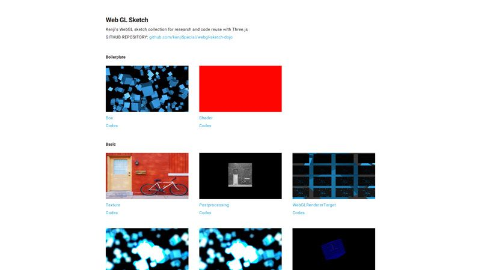

# WEBGL SKETCH DOJO

webgl, mainly with three.js, sketches for practice and work.

url: [webgl-sketch-dojo.kenji-special.info](http://webgl-sketch-dojo.kenji-special.info/)

## References

- [Three.js](http://threejs.org/)
- [Learning Three.js](https://github.com/josdirksen/learning-threejs)
